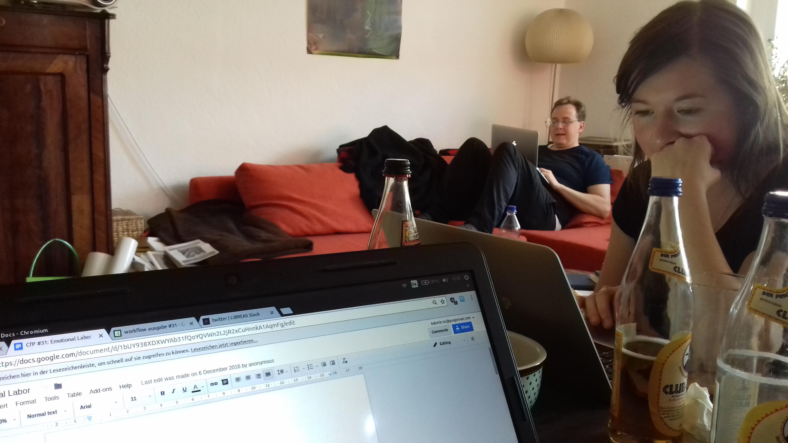

In der Bibliotheksarbeit wird über Communities gesprochen und über
Interessen – aber selten über Gefühle – von Mitarbeiterinnen und
Mitarbeitern oder von Nutzerinnen und Nutzern. Über Veränderung und
Anpassung, Innovation und Weiterentwicklung wird geredet, aber nicht
über die Freuden und Ängste, die während dieser Prozesse auftreten
können. Über hunderte von Projekten wird geredet, aber nicht von den
durchwachten Nächten der Beteiligten, damit Dinge endlich laufen; nicht
über den Zynismus, der sich mit der Erfahrung von dutzenden Projekten
und ihren oft geringen Nachwirkungen einstellt; auch nicht über die
Freude, wenn etwas doch funktioniert oder wohlmöglich über die
Schadenfreude, wenn es das nicht tut. Über Leseförderung und die
Unterstützung von Forschenden wird geredet, aber nicht über den Spaß
oder Stress, den diese Aktivitäten auslösen können.

Irgendwie, so scheint es, wird die Arbeit, die in Bibliotheken geleistet
wird, als von den tatsächlichen Bibliothekarinnen und Bibliotheken
entfremdet, mechanisiert, losgelöst verstanden. Über das Budget kann
diskutiert werden, aber nicht darüber, ob das Personal durch das, was zu
tun ist, emotional belastet oder aufgebaut wird.

Aber das gilt nicht nur für Bibliotheken. In anderen Feldern wird
deutlich lauter kritisiert, dass in unserem Zeitalter, in dem plötzlich
Kreativität als allgemeiner (und nicht nur in der Kunst verorteter) Wert
gilt, gleichzeitig die menschliche Komponente immer mehr in den
Hintergrund rückt: So, als könnten Menschen arbeiten und kreativ sein,
ohne sich selber mit ihren Erwartungen und Gefühlen einzubringen. Das
ist ein Widerspruch.

Gleiches gilt übrigens auch für die (unentgeltliche) Arbeit an Open
Access Zeitschriften, auch wenn sie vergleichsweise langsam entstehen,
wie die LIBREAS. Library Ideas. Auch das wird – entgegen der
funktionalistischen Behauptung, Forschende würden alles tun, um ihre
Reputation zu steigern – nicht einfach so oder aus einem Systemzwang
heraus gemacht. Ginge es allein um Reputation (und VG-Wort-Vergütungen),
würden die Mitgliederinnen und Mitglieder der Redaktion deutlich besser
beraten sein, ihre Energie in Praxishandbücher und Sammelbände zu
investieren. Sie investieren sie aber an dieser Stelle, mit allem was
daraus folgt, also auch den emotionalen Höhen und Tiefen.
Redaktionsarbeit, das wissen alle, die es einmal versucht haben, besteht
zum überwiegenden Teil aus den Mühen der Ebene, auch aus Enttäuschungen,
wenn Dinge wieder länger dauern, nicht erledigt werden, wenn
Missverständnisse entstehen, wenn man eine Ausgabe zähneknirschend noch
drei Wochen für einen Beitrag liegen lässt, der dann doch abgesagt wird.
Zwischendrin jedoch gibt es auch positive Überraschungen – wenn Dinge
doch funktionieren, wenn Treffen produktiv und zugleich fröhlich
verlaufen, wenn viel Goodwill zu spüren ist oder einfach nur ein
wirklich gutes Manuskript im E-Mail-Fach landet. Redaktionsarbeit ist
Arbeit, auch *emotional labor*. Jede Ausgabe zeigt immer neu, dass es
nicht damit getan ist, einfach Texte einzuwerben, zu bewerten und zu
korrigieren. Sie dann endlich online zu haben ist durchaus eine Art
Glücksgefühl.

Ausgabe \#31 versucht sich, wie immer nur zu dem Teil, der möglich war,
dem Thema zu nähern. Dabei hat uns – Achtung, Emotion – erstaunt, dass
das sonst gerne einmal angetönte Unterthema "Bibliotheksangst" nicht
bearbeitet wurde. Wir hätten uns, wie immer, noch mehr Beiträge und mehr
Diversität erhofft und gewünscht. Aber nach der Erfahrung unter anderem
von 30+x Ausgaben und auch aus anderen Wahrnehmungsräumen wissen wir um
die Gründe hinter der mehr tröpfelnden als rauschenden Diskurskultur im
deutschen Bibliothekswesen und der deutschen Bibliothekswissenschaft.
Auch das hat mit *Emotional Labor* zu tun und insbesondere mit dem
Phänomen der Leidenschaft. Wir wünschen uns an dieser Stelle mehr Mut,
mehr Neugier, mehr Experimentierfreude. Vielleicht auch mehr Gefühl.
Warum nicht?

Ihre / eure Redaktion LIBREAS. Library Ideas

(Berlin, Chur, Dresden, Göttingen, München)
