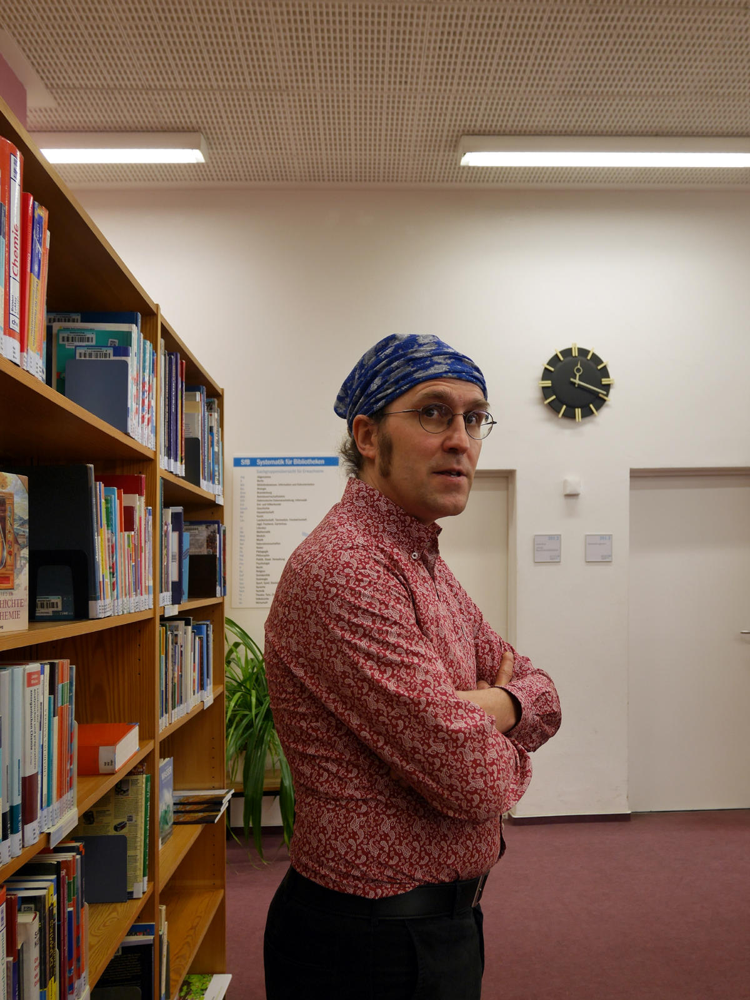
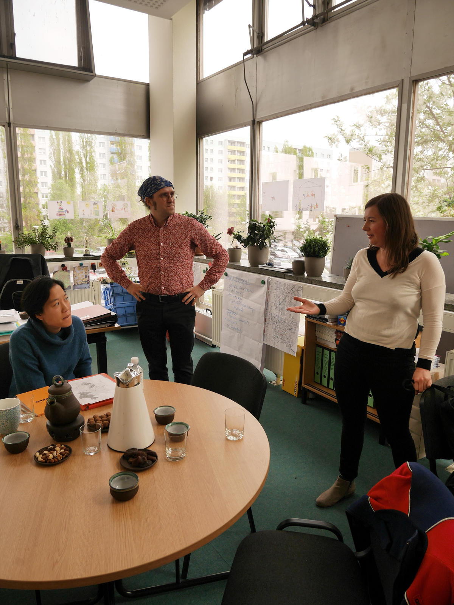
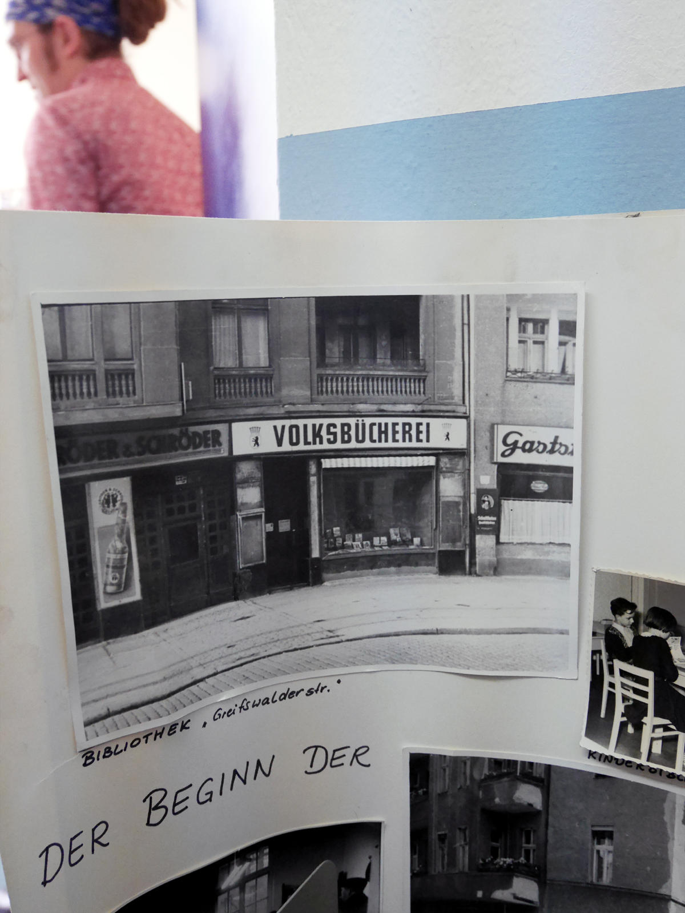

"Von allen meinen Bibliotheken ist in dieser wohl am meisten zu tun",
sagt Danilo Vetter, seit einem dreiviertel Jahr der Leiter der
öffentlichen Bibliotheken im Berliner Bezirk Pankow. Pankow – das ist
der in vielerlei Hinsicht legendäre Prenzlauer Berg. Pankow ist aber
auch die Vorstadtwelt von Karow-Buch. Pankow ist auch
Majakowski-Ring-Pankow. Pankow ist das aufstrebende Bürgerviertel
Weißensee mit eben diesem und dem größten jüdischen Friedhof Europas.
Pankow ist auch die bibliotheksfreie Landgemeinde Blankenfelde. "Wir
überlegen, wie wir diese Gegend möglicherweise mit einem Bus versorgen
können." Und zugleich: "Die Bibliothek an der Schönhauser Allee ist
deutlich zu klein. Sie wird regelrecht überrannt. Aber da etwas dazu zu
mieten, ist illusorisch." Danilo Vetter hat zahllose Baustellen, viel
Arbeit hinter sich und noch nicht einmal richtig begonnen. Sein Büro
liegt hofseitig in der oft vergessenen Plattenbauhälfte des Prenzlauer
Berges. Die getönten Scheiben lassen es im Berliner Sommer zum Treibhaus
werden. Die in den Ritzen des Blocks brütenden Spatzen ergänzen dieses
Gefühl um eine Art Regenwaldtonspur. Gewöhnungsbedürftig ist dies
zunächst, aber nicht ungemütlich. Es gibt Tee und wir schauen gemeinsam
auf eine große Tafel. Die ist sehr gut gefüllt. Bestandsaufnahme trifft
auf To-Do-Listen trifft auf Kinderzeichnungen, was fast zwingend wirkt,
machen doch je nach Standort Kinderbücher bis zu 60 % der Entleihungen
aus. Am meisten am Standort an der per Klischee mittlerweile
wohlhabendsten Ecke des Bezirks – in der Bibliothek am Wasserturm an der
Prenzlauer Allee. Warum eigentlich? Wo kultureller und materieller
Wohlstand sich so gelungen verbinden, wie dort, braucht man doch die
Bibliothek wohl nicht zwingend zur Medienversorgung? "Bei Kindern ist
das anders", sagt Danilo Vetter. "Die haben schon mal einen Durchsatz
von zwanzig Büchern in der Woche. Die lesen nicht alle, aber die wollen
alle durchblättern." Und diese Quantitäten will nun auch jemand mit
finanziell sehr gefüttertem Hausstand nicht im Kinderzimmer anhäufen.
Daher die Bibliothek, die als willkommener Dienstleister sehr zentral
und gut erreichbar liegt.

Dienstleister ist das Stichwort, das vielleicht nicht auf eine
Faustregel, aber doch immerhin eine empirische Auffälligkeit hinführt:
"Das Anspruchsdenken ist in diesen Gegenden schon merklich höher. Die
Nutzer\_innen fordern mehr, dass die Bibliothek in ihrem Dienst steht.
Was vor allem die Mitarbeiter\_innen herausfordert, die größtenteils in
einem anderem Bibliothekssystem, nämlich dem der DDR, gelernt haben.
Diese Dynamik gilt es aufzufangen und wir lernen alle immer sehr viel
dazu." Dass das Bibliothekssystem in Pankow lange Jahre ohne richtige
Leitung war ist für diese Praxis gar nicht nur schlecht. "Man lernte,
sich selbst zu organisieren." Obwohl eine solche Aussage vermutlich mehr
in Richtung Zweckoptimismus weist. Und die Frage aufwirft, ob sich die
Mitarbeiter\_innen dann aber **motiviert** unter einer neuen Leitung
zusammenfinden? "Zum einen sind alle **erleichtert**, dass es wieder
eine Leitung gibt. Und zum anderen ist mein Ansatz bewusst inklusiv. Ich
habe die ersten Monate genutzt, um mich wirklich mit allen zu
Einzelgesprächen zu treffen." Es gab Tee, Signale des aufrichtigen
Interesses, die Bereitschaft zum Zuhören und dank dieser Mischung den
Abbau von **Vorurteilen** und **Ängsten**. "Das war schon eine
interessante Erfahrungen. Das Bibliothekswesen im Bezirk war über
Jahrzehnte vor allem durch Abbau, Einsparungen und Kürzungsmaßnahmen
gekennzeichnet. Einzelgespräche in diesen Einrichtungen bedeuteten nie
etwas Gutes. Entweder wurde eine Umorientierung angeregt, eine
Schließung verkündet oder man sah, dass ein Verwaltungsmitarbeiter
hinter dem eigenen Namen ein kw (Kann weg) vermerkt hatte."

Andere Denkweisen, Arbeitsweisen und auch ein anderes Aussehen kann
zunächst Irritationen und Verunsicherung auslösen, so beschreibt Vetter
seinen Einstieg. Jeder neue Leiter, der vor diesem Erfahrungshorizont
zum Gespräch einlädt, bekommt zwangsläufig einen Misstrauensvorschuss.
Der jedoch ließ sich, so die Auskunft, in allen Fällen zerstreuen. Dazu
gehört auch, jeder\_m Mitarbeiter\_in das "Du" anzubieten, um auf
Augenhöhe kommunizieren zu können, was von nahezu allen so angenommen
wurde. Es war für die Mitarbeiter\_innen eine gänzlich neue Erfahrung,
im Chef ein wirklich interessiertes Gegenüber zu finden, dem man
**vertrauen** kann und sollte, weil er es sehr sehr gut meint. In
manchen Fällen brauchte das drei Termine, bei anderen nur eine halbe
Stunde. Für weiteren oder tiefergehenden Gesprächsbedarf bietet der
Bezirk Pankow sogar eine psychologische Beratung an, eine
Berater-Flatrate, die telefonisch oder in persönlichen Gesprächen von
den Mitarbeiter\_innen genutzt werden kann. Ein sehr sinnvolles Angebot,
zumal sich manche Konflikte und die damit verbundenen Emotionen bereits
seit Jahren aufstauen und nicht immer nur noch in
Mitabeiter\_innen-Gesprächen abgefangen werden können. In diesen
Gesprächen geht es vorwiegend um Emotionen, um ein aktuelles
Stimmungsbild, aber auch darum zu lernen, Emotionen überhaupt zu äußern
und eine Atmosphäre zu schaffen, in der man dies kann. „Ich bin jemand,
der total auf gewaltfreie Kommunikation steht. Und das ist etwas hoch
emotionales. Ich benenne mein Gefühl, was ich in dem Moment habe und
bringe es nach außen." So beschreibt Danilo Vetter seine
Kommunikationsstrategie, bei der es darum geht, Kritik zu üben, ohne
jemanden zu verletzen und trotzdem seine Gefühle äußern. Dabei ist
Vetter bewusst, dass gewaltfreie Kommunikation durchaus auch etwas
Manipulatives hat.

Dass so eine Leitung nicht als Dienst nach Vorschrift, sondern teils
auch als Dekonstruktion der Vorschrift angegangen werden muss, war
Danilo Vetter von vornherein ebenso bewusst, wie das akute Schwinden der
Zeit für viele andere Dinge. Es ist eine wirkliche Vollzeitstelle und
das Auf-der-Strecke-Bleiben der eigenen Nutzung einer Öffentlichen
Bibliothek im eigenen Kiez ist dabei vielleicht der unwichtigste
Nebeneffekt. Dies spiegelt aber wieder ein akutes Problem für das ihm
anvertraute Bibliothekssystem: "Es ist natürlich nicht optimal, dass
unsere Öffnungszeiten parallel zu normalen Arbeitszeiten laufen und wir
nur sehr eingeschränkt zum Beispiel am Samstag öffnen. Viele potentielle
und tatsächliche Nutzer\_innen haben damit ihre Probleme und verstehen
es auch oft nicht so richtig. Andererseits sind erweiterte
Öffnungszeiten sowohl verwaltungs- wie auch personaltechnisch eine
enorme Herausforderung. Die Abrechnung eines Wochenenddienstes kostet
mich mehr, als es an Zuschlägen einbringt. Und auch die
Mitarbeiter\_innen brennen nicht alle darauf, am Samstag Dienst zu
haben."

Dass einige Engpässe durch Ehrenamtliche aufgefangen werden, sieht
Danilo nicht als problematisch an, zumal ein Standort im Bezirk seit
Jahren ausschließlich durch Ehrenamtliche geführt wird. Sicherlich
schürt der Einsatz von Ehrenamtlichen auch dahingehend Ängste bei den
Mitarbeiter\_innen, dass sie ersetzbar sind und der Bezirk auf diese Art
ausgebildetes Personal einsparen könnte. Eine Ehrenamtlichen-Bibliothek
sei aber erstmal besser als keine Bibliothek, so Danilo sinngemäß. Und
er verbindet damit die Hoffnung, die derzeit so betriebene
Kurt-Tucholsky-Bibliothek im Bötzowkiez eines Tages
re-professionalisieren zu können. Denn auf lange Sicht nachhaltig ist
ein auf Freiwilligkeit setzender Bibliotheksbetrieb naturgemäß nicht.
Und das Verfahren eignet sich auch kaum, um aktuelle Trends der
Bibliotheksentwicklung in diesen Betrieb einzubringen.

Aber das ist auch bei den hauptamtlichen Häusern aus verschiedenen
Gründen nicht immer leicht. Bauliche Probleme – so zum Beispiel die
Herausforderung, einen auch außerhalb der Öffnungszeiten nutzbaren
Rückgabeautomaten installieren zu können – treffen auf unterschiedliche
Vorstellungen zur Internetnutzung. Und schließlich kollidieren hier und
da auch einfach Vorstellungen, was eine Öffentliche Bibliothek
eigentlich sei. Auch hier setzt Danilo auf das Gespräch und lädt schon
mal den Datenschutzbeauftragten des Bezirks zum Kennenlerngespräch ein –
ein Novum für beide Seiten, denn auch der Beauftragte wird denkbar
selten angesprochen, wenn es nicht gerade ein akutes Problem gibt.
Vertrauensbildende Maßnahmen sind ein Verfahren, dass man nicht
unterschätzen sollte, auch wenn Langzeiterfahrungen in diesem Fall erst
noch entstehen müssen.

Interessant wird es, diesen Schritt auch stärker mit den Nutzer\_innen
weiterzuentwickeln. So klingt es erst einmal gut, dass Ticketing-System
für die wenigen, natürlich *zu* wenigen, Webterminals abzuschaffen und
eine unbegrenzte Nutzung zuzulassen. Das Problem ist jedoch, dass hier
der frühe Nutzer auch die Maus manchmal den ganzen Tag nicht mehr
loslässt und andere Nutzer\_innen nach zwei Stunden Wartezeit entweder
ihre Frustration ventilieren oder einfach frustriert gehen. Hier wünscht
sich Danilo, dass auch die Nutzer\_innen achtsamer sind und wissen, dass
die Infrastruktur nicht ihr Privatbesitz ist. Und er plant die
Anschaffung von Tablets, um den Bedarf auffangen zu können. Im Zuge des
Projektes "Digitale Welten" wurde bereits ein IPad-Koffer angeschafft
und auch ein Budget für Apps ist vorhanden.

Andere außerplanmäßige Ausgaben können beziehungsweise müssen auch durch
Praktikant\_innen erledigt werden. Danilo arbeitet sehr eng mit diesen
zusammen und lässt sie an seinem Alltag als Leiter teilhaben, so dass
sie einen sehr guten Einblick in eine zukünftige Tätigkeit als leitendes
Personal einer Öffentlichen Bibliothek gewinnen können. Diese
Erfahrungen sind vor allem für Studierende der Bibliotheks- und
Informationswissenschaft sehr wertvoll, da das Curriculum nicht
unbedingt solche Aspekte der Öffentlichen Bibliotheksarbeit umfasst und
die Studierenden gerade erst den Versuch, die Bibliothek ganz aus dem
Institutsnamen zu streichen, abgeblockt haben. Das Thema Öffentliche
Bibliotheken scheint zwar im stadtgesellschaftlichen Rahmen wieder an
Bedeutung zuzulegen. Im akademischen Kontext der Bibliothekswissenschaft
wird sie aber seit mindestens 15 Jahren marginalisiert, was nicht nur
viele Studierende des Faches kurzsichtig finden. Aber das wäre ein
anderes Thema.

Oder auch nicht, denn Danilo spürt, wie der Stand der gegenwärtigen
Ausbildung ist, schon daran, dass es nicht immer einfach ist, geeignetes
Personal zu finden. Momentan gehen die Überlegungen eher dahin,
Medienpädagog\_innen oder Sozialarbeiter\_innen einzustellen, da diese
einfach für den konkreten Bedarf passender erscheinen und das
Bibliothekspersonal sehr gut ergänzen würden. Öffentliche Bibliotheken
sehen sich sicher auch mit Phänomenen der Digitalisierung konfrontiert.
Aber die Idee, dass sie irgendwann plattformbasierte Digitale
Bibliotheken seien werden, ist, wie man sofort beim Betreten der
Einrichtungen feststellt, komplett abwegig. Die reine
Informationsversorgung ist nur ein Facette und möglicherweise sogar eine
nachgeordnete. Natürlich wollen die vorwiegend Männer, die ab morgens um
zehn die Tagespresse im Leseraum über der Greifswalder Straße
durchblättern, auch informiert sein. Aber vielen scheint der Gang zur
Zeitung in der Bibliothek auch ein tägliches Ritual zu sein, das dazu
beiträgt, ihren Tag zu strukturieren. Die Bibliothek ist hier vermutlich
schon ein Dritter Ort, vielleicht für viele sogar nur der Zweite. Sie
ist spürbar für viele auch eine Teilhabeeinrichtung, was sich
unterschiedlich manifestiert und nicht immer nur zu harmonischen
Situationen führt.

Noch eine Herausforderung also für den neuen Leiter. Und auch die gilt
es zu integrieren, in die Entwicklung bedarfsgerechter Dienstleistungen
für die realen und nicht nur idealtypischen Zielgruppen der
Bibliotheken. Umsetzen lässt sich das natürlich nur mit
leidenschaftlichen und motivierten Mitarbeiter\_innen. Nicht alle von
ihnen brauchen unbedingt viel Schwung durch den Bibliotheksleiter. Bei
vielen Mitarbeiter\_innen fällt ein, wie man so schön sagt,
intrinsischer Antrieb geradezu auf und es wird wohl nicht nur ein
Danilo-Vetter-Effekt sein. Wer in dieser Branche aktiv ist, ist schon
frühzeitig damit konfrontiert, eher wenige Aussichten auf große
Gehaltssprünge und Karriereschritte zu haben. Wer hier einsteigt ist
durch etwas anderes motiviert. Ein Dienst nach Vorschrift ist weder
gewünscht noch möglich. Überstunden lassen sich so gut wie nicht
vermeiden. Danilo Vetter kämpft darum, dass sie wenigstens fair vergütet
werden. Bei Neueinstellungen achtet er übrigens besonders darauf, was
dies bei den jeweiligen Bewerber\_innen ist. Das Hobbie "Bücher lesen"
begeistert ihn dabei übrigens nicht besonders. Die Öffentliche
Bibliothek mag sich nach wie vor über das Medium Buch definieren. Aber
gerade für die Verknüpfung mit der Stadt und ihren Menschen ist eine
größere Vielfalt der Interessen und Anknüpfungspunkte nicht nur ein
Bonus.

Dennoch brauchen auch die Motiviertesten Führung in ihrem positivsten
Sinne, nämlich, dass ein Einverständnis darüber besteht, was man sein
will, was man leisten kann und möchte und wie man den Veränderungen, und
zwar auch denen im Kiez, in der eigenen Arbeit begegnet. Ein Beispiel
ist eine völlig neue Gruppe von Nutzer\_innen, die seit 2015 durch
Bibliotheken auch in Pankow adressiert wird: Geflüchtete. Besonders in
Berlin-Buch wird in diesem Zusammenhang deutlich, wie sehr eine
Stadtbibliothek auch eine Funktion der stadtgesellschaftlichen
Gestaltung übernehmen kann und vielleicht auch muss.

Das gilt im übergeordneten Zusammenhang natürlich nicht nur für die
kleine Zweigbibliothek im Norden des Bezirks, sondern für alle Pankower
Bibliotheken – in jeweils sehr unterschiedlichen Formen und vor allem
mit unterschiedlichen Voraussetzungen. An der einen Stelle können
vielleicht Makerspaces installiert sein. An einer anderen geht es
klassisch um Leseförderung. Woanders ist die Bibliothek kultureller
Anlaufpunkt der Senioren aus der Nachbarschaft. Und an manchen Stellen
stehen eben die anspruchsstarkten Eltern aus dem Kollwitz-Kiez am
Tresen. Konflikte, emotionale Spannungen treten auch – und oft auch
gerade bei stark bei hochmotivierten Mitarbeiter\_innen – auf. Wer sich
sehr mit seiner Arbeit identifiziert, ist zwangsläufig auch in jeder
Hinsicht leidenschaftlicher beteiligt. So ist ein nicht zu
unterschätzender Teil der Arbeit eines Bibliotheksleiters, einer
Bibliotheksleiterin, zu vermittlen, zu lenken, auf- und abzufangen und
Lösungen zu finden, bei denen alle zumindest das Gesicht und vor allem
auch die Motivation behalten. Für Danilo Vetter wird dies vermutlich
auch bedeuten, seine eigenen Vorstellungen von der idealen Bibliothek
hier und da zurücknehmen zu müssen. Sein großes Ziel, so wie wir es aus
unserem Gespräch verstanden haben, wird er aber hoffentlich möglichst
kompromisslos durchsetzen: Die Bibliotheken des Bezirks Pankows als
einen Ort des positiven, produktiven sozialen Miteinanders von
Nutzer\_innen, Mitarbeiter\_innen und der Stadtgesellschaft insgesamt zu
etablieren. Oder, vielleicht noch knapper, als einen der **Freude**.
