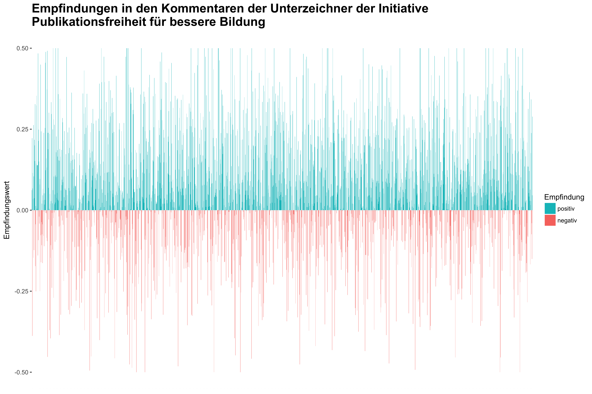

Das Titelbild möchte Empfindungen im Zuge der Urheberrechtsnovellierung anhand der Kommentare der Unterstützer des Appells "Publikationsfreiheit - für eine starke Bildungsrepublik"[^1] einfangen. Am 30. Juni hat der Bundestag Schrankenregelungen zur Nutzung urheberrechtlich geschützter Werke in Bildung und Forschung reformiert, die zum 1. März 2018 in Kraft treten werden. Einzelne Verleger wollten mit dem Appell im Vorfeld der Abstimmung öffentlichkeitswirksam auf ihre Anliegen hinweisen und forderten zugleich den Bundestag auf, die Abstimmung über den Gesetzentwurf der Bundesregierung in die nächste Legislaturperiode zu verschieben. Während der Appell seitens der Frankfurter Allgemeinen Zeitung positiv aufgenommen wurde, warfen Bibliothekare wie Eric Steinhauer der Kampagne eine Irreführung von Wissenschaft, Politik und Öffentlichkeit vor. Zudem wären die Unterzeichnerinnen und Unterzeichner des Appells nicht repräsentativ für die wissenschaftlich Beschäftigten an Hochschulen und Forschungseinrichtungen in Deutschland.[^2]

Was bleibt, sind bis dato 2.357 Kommentare der Unterzeichner des Appells. Die Frage, die uns beschäftigt hat, war, welche Stimmungen und Empfindungen sich gegenüber der geplanten Urheberrechtsreform in den Kommentaren ausdrücken. Zu diesem Zwecke haben wir eine Sentimentanalyse durchgeführt. Die Sentimentanalyse ist ein Verfahren des Text-Mining, das mit Methoden des maschinellen Lernens, Aussagen als positiv oder negativ charakterisiert. Voraussetzung ist ein Korpus, das positiv und negativ konnotierte Wörter oder Wortgruppen enthält und entsprechend gewichtet. Zwar existieren auch für die deutsche Sprache entsprechende Wortschätze.[^3] Wir haben uns jedoch aufgrund der einfachen Nachnutzung für die Text Analytics API von Microsoft entschieden, die insbesondere auf die Unterützung von Kommunikationsprozessen in Unternehmen zielt.[^4] Die Analyse erfolgte mittels der statistischen Programmierumgebung R und folgt der Methodendarstellung im kürzlich erschienen Buch "Text Mining with R - A Tidy Approach" von Julia Silge und David Robinson.[^5]

Nachfolgend beschreiben wir, wie wir die Daten gewonnen und die Abbildung für das Titelbild visualisiert haben. Zunächst wurden die Kommentare aus der Webseite der Initiative extrahiert, Formatierungszeichen entfernt und ein Datensatz zum Abgleich mit der Text Analytics API erstellt.


```r
# required libraries
library(dplyr)
library(httr)
library(xml2)

u <- "https://www.publikationsfreiheit.de/der-appell/"
req <- httr::GET(u) %>%
  httr::content()
texts <-
  xml2::xml_find_all(req, '//*[@id="packery-container"]//section//article') %>%
  xml2::xml_text()
#
text_df <- data_frame(texts) %>%
  mutate(text = gsub(
    "\n                                Ich unterstütze die Publikationsfreiheit, weil ...\n",
    "",
    texts
  )) %>%
  mutate(text = gsub("\\n.*$", "", text)) %>%
  mutate(text = gsub("         ", "", text)) %>%
  mutate(id = rownames(.)) %>%
  select(text, id) %>%
  mutate(language = "de")
```


Die Text Analytics API ist mittels eines API-Keys zugriffsbeschränkt und ermöglicht je Aufruf die Analyse von bis 1000 Textabschnitten. Der Key ist bei uns definiert als Funktion `text_get_key()`


```r
## API CALL
## The api takes a maximum of 1000 but we got 2357, so let's loop over the data

sentiments <- dplyr::data_frame()

for (i in seq(1, nrow(text_df), by = 1000)) {
  req <- httr::POST(
    url = "https://westus.api.cognitive.microsoft.com/text/analytics/v2.0/sentiment",
    body = jsonlite::toJSON(list(documents = dplyr::slice(
      text_df, i:(i + 999)
    )),
    auto_unbox = TRUE),
    httr::accept_json(),
    httr::content_type_json(),
    httr::add_headers("Ocp-Apim-Subscription-Key" = text_get_key())
  ) %>%
    httr::content()
  out <- req$documents %>%
    dplyr::bind_rows()
  sentiments <- dplyr::bind_rows(sentiments, out)
}
```

Ergebnis ist eine Tabelle, die je Kommentar einen Wert zwischen 0 (negativ) und  1 (positiv) zuweist.


```r
sentiments
#> # A tibble: 2,357 x 2
#>        score    id
#>        <dbl> <chr>
#>  1 0.5619398     1
#>  2 0.9084251     2
#>  3 0.5422977     3
#>  4 0.5671694     4
#>  5 0.5663299     5
#>  6 0.5910998     6
#>  7 0.2581929     7
#>  8 0.6130945     8
#>  9 0.5544790     9
#> 10 0.7222222    10
#> # ... with 2,347 more rows
```

Für die Abbildung möchten wir allerdings 0 als neutralen Wert definieren und normalisieren den Sentimentwert des Scores entsprechend der neuen Skale, die von -0.5 und +0.5 reicht.


```r
sentiments_df <- left_join(text_df, sentiments, by = "id") %>%
  mutate(score_nor = score - 0.5) %>%
  mutate(score_category = ifelse(score_nor > 0, "positiv", "negativ"))
# export
library(readr)
readr::write_csv(sentiments_df, "sentiment_publikationsfreiheit.csv")
```

Der Datensatz ist unter [sentiment_publikationsfreiheit.csv](sentiment_publikationsfreiheit.csv) verfügbar.

Die Sentimentwerte werden abschließend als Säulendiagramm visualisiert, das jeden Kommentar mit seinem Sentimentwert abbildet:


```r
# plot
library(ggplot2)
ggplot(sentiments_df, aes(id, score_nor, fill = score_category)) +
  geom_bar(stat = "identity") +
  theme(
    axis.title.x = element_blank(),
    axis.text.x = element_blank(),
    axis.ticks.x = element_blank()
  ) +
  ylab("Empfindungswert") +
  guides(fill = guide_legend(reverse = TRUE),
         colour = guide_legend(reverse = TRUE)) +
  scale_fill_discrete(name = "Empfindung") +
  ggtitle(
    "Emotionsanalyse der Kommentare der Unterzeichner der Initiative\nPublikationsfreiheit für bessere Bildung"
  ) +
  theme(plot.title = element_text(size = 12, face = "bold"))
```


```r
ggsave("img/sentiment_abbbildung.png", dpi = 450)
```



Es scheint, als wäre der Großteil der Kommentare neutral bis positiv konnotiert und extrem negative Aussagen blieben die Ausnahme. 

[^1]: <https://www.publikationsfreiheit.de/>

[^2]: <https://irights.info/artikel/publikationsfreiheitde-unterzeichner/28410>

[^3]: z.B. SentiWS: <http://wortschatz.uni-leipzig.de/de/download>

[^4]: <https://azure.microsoft.com/en-us/services/cognitive-services/text-analytics/>

[^5]: <http://tidytextmining.com/>
