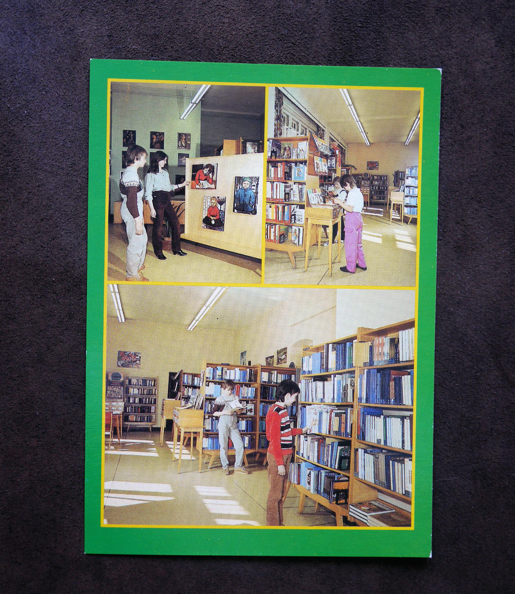

Als ich 10 oder 11 Jahre alt war, trennten sich meine Eltern zum ersten
Mal. Meine Mutter und ich zogen in eine Plattenbauwohnung in einem
Kieler Vorort, mein Vater blieb in Rostock, wo er als Tischler
arbeitete. In den ersten Wochen war es für mich schwer, mich in der
neuen Schule zurecht zu finden. Ich war mitten im Schuljahr in die
Klasse gekommen und es würde eine Weile dauern, bis ich mich in die
Klassengemeinschaft eingewöhnen konnte. Bis dahin verbrachte ich nicht
nur meine Freizeit, sondern auch viele Schulpausen in der Bibliothek,
die wie ein Aprikosenkern in der Mitte des modernen Schulgebäudes saß
und Zuflucht bot, rundherum hinter dicken Glasscheiben die wimmelnden
Schüler auf Bänken, die Gespräche wie brummende Bienenschwärme.

Durch den Eingang gelangte man direkt an die Theke, hinter der sich
nicht nur die Bibliothekarinnen (immer Frauen, immer freundlich)
befanden, sondern auch ein riesiges Fenster, das auf einen
zugewucherten, fast exotisch wirkenden Garten hinausging, der von außen
kaum zugänglich war. Bog man links ab, kam man in einen riesigen Raum
voller Regale, die nach Genres, Themen und Altersgruppen angeordnet
waren. In dieser Zeit las ich neben den typischen Gruselromanen und
Comics vor allem eins: Hundebücher. Keine Romane oder Kurzgeschichten,
sondern Sachbücher über Hunderassen, Hundeaufzucht, Hundepsychologie.
Ich schleppte reihenweise groß bebilderte Bände nach Hause und las mir
durch, welche Rassen besonders geeignet für das Klima in Deutschland
waren, wie man einen jungen Hund richtig erzog und wie man testen
konnte, ob der Hund jaulte, wenn man tagsüber weg war (die Antwort ist
wenig überraschend: man tut so als ob man geht und lauscht dann im
Hausflur). Für mich gab es zu dieser Zeit keinen anderen Gedanken als
den, einen Hund zu haben, ihn vorbildlich zu erziehen und fortan nicht
mehr alleine zu sein.

Die Pointe dieser Geschichte ist kurz und schmerzlos: kurz nach
Weihnachten, das ich mit meinen Großeltern und meinem Vater in Rostock
verbracht hatte, kehrte ich heim in unsere Plattenbauwohnung und dort,
unter einer Kommode, saß eine verängstigte Heimkatze. Der Traum vom Hund
war damit vorbei, doch ich kann den besorgten Leserinnen und Lesern
versichern: "Iphie" war der Anfang einer ungebrochenen Liebe zu Katzen
und Katern.

Die Bibliothek ist mein roter Faden, der Umzüge, Interessen,
Hausaufgaben, Semesterarbeiten und Wochenendpläne verknüpft, mir die
Erinnerung anhand von Stempelsystem und Lochkarten erleichtert und Regal
für Regal archiviert, was mich irgendwann einmal beschäftigt hat.

Ob in den vollgestopft und nicht immer sinnvoll strukturierten Räumen
der Geisteswissenschaften der Rostocker Universität bis hin zur
Containerlösung der Stadtbibliothek Cardiff während das neue Gebäude in
der Innenstadt Form annahm. Im Container eine Tür zum nächsten
Container. Neben der Tür ein großer Schrank, an dessen Tür ein Zettel:
"This is a cupboard, not a door."

Die Bibliothek bietet eine Art Flucht nach vorn oder zurück, zwischen
zwei Einbänden und über Fachliteratur hinaus. Durch Stempelkarten und
Scancodes hinein in die tiefen Decken und bunten Kissen der
Kinderbibliothek. Natürlich ist sie auch ein Ort der Anderen, immer auch
das. Aber viel häufiger ist sie ein Ort des Eigenen. Der eigenen Welt,
der eigenen Ambitionen und der eigenen Hundeträume, die man beäugt,
Buchrücken für Buchrücken mustert und dann aufeinander gestapelt an der
Theke abgibt, ein Kochbuch, eine Sammlung von Kurzgeschichten und der
eine Klassiker, den man schon immer mal lesen wollte. Mindestens ein
Buch wird ungelesen verlängert und dann noch mal und dann zurückgegeben.
Ein anderes wird später gekauft und verschenkt, "da musste ich an Dich
denken, Du magst doch die Schweden so gerne." Und wieder ein anderes
wird so schnell gelesen, dass es schon am nächsten Tag gegen ein anderes
desselben Autors ausgetauscht wird.

Das was Ihr hier lest, das was ich schreibe, das ist meine Bibliothek.
Eine gefühlte Bibliothek. Damals, die Treppen hoch zur Administration,
zu viele Bücher, zu spät. Die Angst im Magen und das Taschengeld in der
Tasche. Ein halbes Jahr später das Ganze von vorne.

Und noch davor, eine bunte Nacht in einem unbestimmten Alter in einer
Kinderbibliothek im Nirgendwo und "Der kleine Wassermann" und "Jim
Knopf" liefen auf Kassette, bis wir einschliefen. Viel später die
schmalen Regale der Universitätsbibliothek der Geisteswissenschaften,
wie es fast ein Eindringen war, wenn ein anderer Student die kleinen
Räume betrat. Und der erste Ausweis in einer neuen Stadt, es wird mit
einem vollen Rucksack gefeiert.

Es gibt dieses berühmte Zitat von Borges, "Ich habe mir immer
vorgestellt, dass das Paradies eine Art Bibliothek sei." Viel spannender
als das, wenn auch zutreffend, ist jedoch seine Idee der unendlichen
Bibliothek. Diese ergibt sich auch aus der ständig neuen Kombination des
Alten und Bekannten. Besucht man Bibliotheken in Deutschland, so gibt es
bald einen Wiedererkennungswert in den Regalen, den Computern,
Ausleihsystemen und natürlich dem Ordnungssystem. Doch für jeden
Besucher steckt in dieser Gleichheit auch etwas ganz Eigenes, sei es in
der ersten oder letzten Erinnerung zwischen den Buchrücken. Und diese
Erinnerung ist für den Einzelnen eine Art Heimkehr, für die Bibliothek
jedoch die Unendlichkeit der möglichen Erfahrungen und Rezeption ihrer
Inhalte, mit jedem Besuch, mit jedem Buch.
